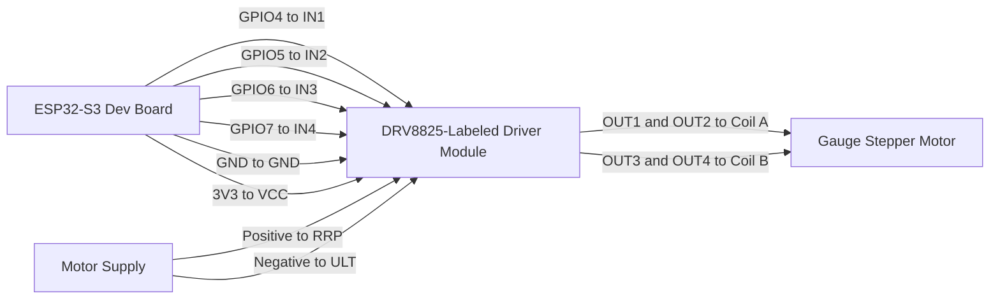

# Stepper Gauge Bench Test (270 Degree Sweep)

This bench test uses a 4-wire stepper motor with your DRV8825-labeled module that exposes these terminals:

- IN4
- IN3
- GND
- VCC
- IN2
- IN1
- RRP
- OUT1
- OUT2
- OUT3
- OUT4
- ULT

## Wiring

### ESP32-S3 to driver module (control side)

- ESP32 GPIO4 -> IN1
- ESP32 GPIO5 -> IN2
- ESP32 GPIO6 -> IN3
- ESP32 GPIO7 -> IN4
- ESP32 GND -> GND
- ESP32 3.3V -> VCC

### Driver module to motor and power

- Connect one motor coil to OUT1 and OUT2
- Connect the other motor coil to OUT3 and OUT4
- Connect motor supply positive to RRP
- Connect motor supply negative to ULT
- Ensure motor supply negative and ESP32 GND are common

Important:
- Do not power the motor from ESP32 3.3V.
- Start with a low motor voltage/current and increase carefully.
- If direction is wrong, swap one coil pair (OUT1/OUT2 or OUT3/OUT4).

### Identify the two coil pairs (multimeter method)

For a 4-wire stepper, first identify the two wires for each coil:

1. Set a multimeter to resistance mode.
2. Pick one wire and measure resistance to each other wire.
3. The one wire that shows low resistance with it is the same coil pair.
4. The two remaining wires are the second coil pair.
5. Connect one pair to OUT1/OUT2 and the other pair to OUT3/OUT4.

## PlatformIO Wiring Diagram (Mermaid)

## Notes on this module labeling

This terminal naming does not match the most common STEP/DIR DRV8825 breakout silkscreen. It does match the current firmware approach (4 control inputs: IN1..IN4), so the mapping above is aligned to the code currently in this project.

The current wiring has no electrical feedback line from the driver back to the ESP32. That means firmware cannot reliably detect whether the driver module or motor is physically connected. The status page and serial output therefore report this as not verifiable without feedback.

## Motion profile in firmware

Configured in include/config.h and implemented in src/main.cpp:

- Sweep clockwise through 270 degrees in 1.0 second
- Pause 1.0 second at max position
- Sweep back to start in 0.5 second
- Pause 1.0 second at start
- Repeat continuously

## Build and flash

From the project root:

- Build: ~/.platformio/penv/bin/platformio run
- Upload: ~/.platformio/penv/bin/platformio run --target upload --upload-port /dev/cu.usbmodem101

If your serial port changes, list devices with:

- ~/.platformio/penv/bin/platformio device list
